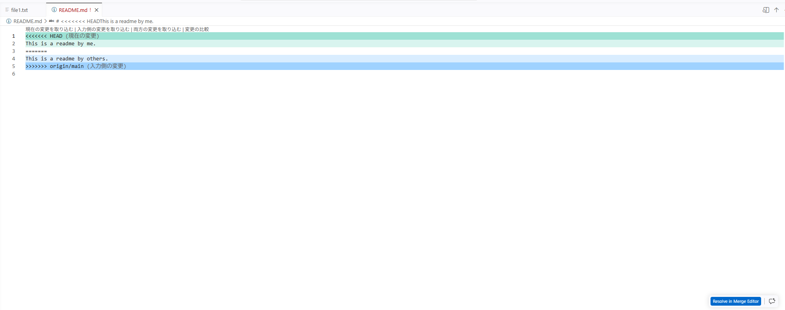
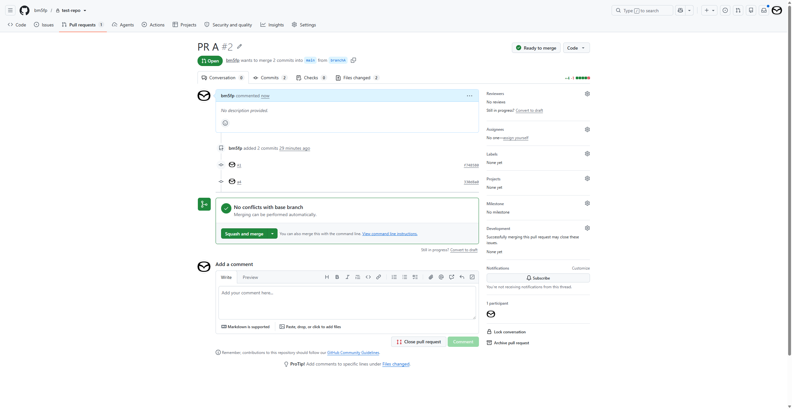
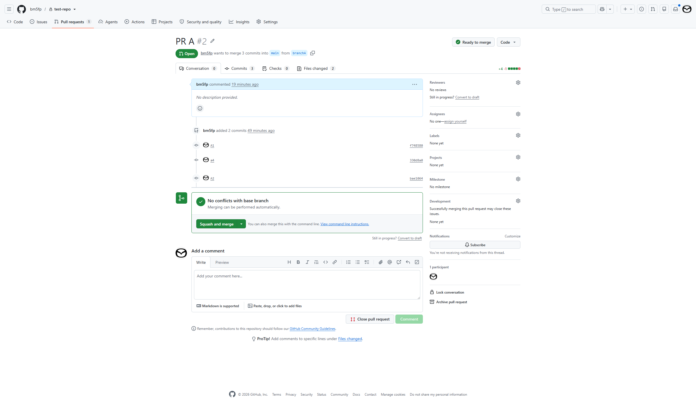
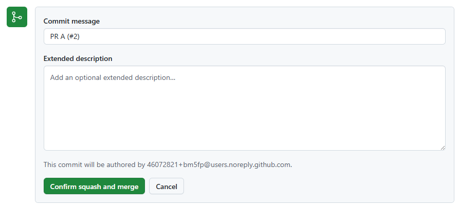
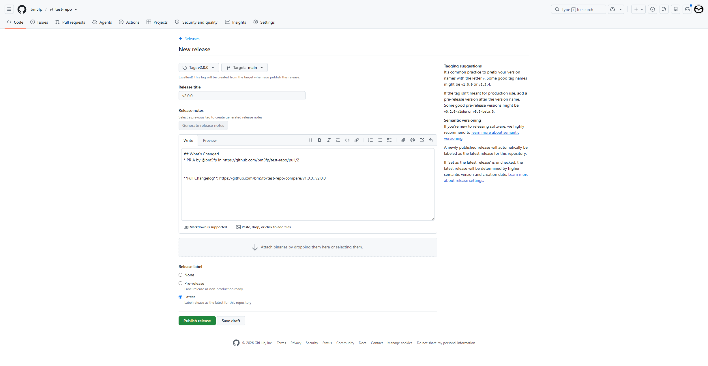

# Gitによる開発サイクル

gitには様々なブランチ戦略に基づく開発サイクルがありますが、私は以下のサイクルを基本としています。

* 作業用のブランチは使い捨て（orgin/mainにマージしたら削除する）
* プッシュ前にローカルのコミットは纏める
* プルリクエストをマージする際には、コミットを纏める


## 開発サイクルの流れ

### Step0:ブランチの作成

初めにリポジトリを作成します。

### Step1:作業用ローカルブランチの作成

mainブランチをローカルにクローンします。（GitHub Codespacesの場合はインスタンスの作成になります。）

そして、新しく作業用のブランチを作成します。

```bash
@bm5fp ➜ /workspaces/test-repo (main) $ git branch branchA
@bm5fp ➜ /workspaces/test-repo (main) $ git branch
  branchA
* main
@bm5fp ➜ /workspaces/test-repo (main) $ git switch branchA
Switched to branch 'branchA'
@bm5fp ➜ /workspaces/test-repo (branchA) $ 
```

### Step2:コード開発

コードを開発し、コミットします。

```bash
@bm5fp ➜ /workspaces/test-repo (branchA) $ git log --oneline
7683fc7 (HEAD -> branchA) a3
a1657de a2
39f8b11 a1
9e7097c (main) Initial commit
```

### Step3:mainブランチのマージ

コード開発が終わったら、リモートブランチにプッシュする前に、mainブランチの内容をマージします。

```bash
@bm5fp ➜ /workspaces/test-repo (branchA) $ git merge origin/main
Auto-merging README.md
CONFLICT (content): Merge conflict in README.md
Automatic merge failed; fix conflicts and then commit the result.
```

コンフリクトが発生した場合は、その内容を解消します。



その上で、再度コミットします。

```bash
@bm5fp ➜ /workspaces/test-repo (branchA) $ git log --oneline
4f9c722 (HEAD -> branchA) a4
7683fc7 a3
01063c7 (tag: v1.0.0, origin/main, origin/HEAD) PR B (#1)
a1657de a2
39f8b11 a1
9e7097c (main) Initial commit
```

### Step4:ローカルコミットの整理

コミットa1～a3は、ローカル開発のため`git rebase -i`にて1つにまとめます。
a4はマージコミットのため、履歴としてそのまま残します。

```bash
@bm5fp ➜ /workspaces/test-repo (branchA) $ git rebase -i --rebase-merges 9e7097c
```

コマンドを実行すると、修正用ファイルが表示されます。
下記のように2つのフローが確認できます。

```txt
label onto

# Branch a4
reset onto
pick 01063c7 # PR B (#1)
label a4

reset onto
pick 39f8b11 # a1
pick a1657de # a2
pick 7683fc7 # a3
merge -C 4f9c722 a4 # a4
```

`squash`にて、a1～a3を1つにまとめます。
修正用ファイルを閉じると、新たなコミットコメント用ファイルが表示されます。

```txt
# This is a combination of 3 commits.
# This is the 1st commit message:

a1

# This is the commit message #2:

a2

# This is the commit message #3:

a3

# Please enter the commit message for your changes. Lines starting
# with '#' will be ignored, and an empty message aborts the commit.
#
# Date:      Sat Jul 18 08:37:02 2026 +0000
#
# interactive rebase in progress; onto 9e7097c
# Last commands done (8 commands done):
#    squash a1657de # a2
#    squash 7683fc7 # a3
# Next command to do (1 remaining command):
#    merge -C 4f9c7225a6692936f0504badce545cb7db91a571 a4 # a4
# You are currently rebasing branch 'branchA' on '9e7097c'.
#
# Changes to be committed:
#	modified:   README.md
#	new file:   file1.txt
#
```
コミットコメントを「A1」に修正します。
今回は、纏めたコミットAとマージコミットにコンフリクトがあるため、再度コンフリクトが発生します。

```bash
@bm5fp ➜ /workspaces/test-repo (branchA) $ git rebase -i --rebase-merges 9e7097c
[detached HEAD f748580] A1
 Date: Sat Jul 18 08:37:02 2026 +0000
 2 files changed, 4 insertions(+), 1 deletion(-)
 create mode 100644 file1.txt
Auto-merging README.md
CONFLICT (content): Merge conflict in README.md
Could not apply 4f9c722... a4 # a4
@bm5fp ➜ /workspaces/test-repo (f748580) $ 
```


`git rebase`にて発生したコンフリクトは、ファイルを修正後`git rebase --continue`にて解消します。（マージによるコンフリクトの場合は、コンフリクト部分を修正した上でコミットにより解消しますが）

```bash
@bm5fp ➜ /workspaces/test-repo (f748580) $ git rebase --continue
[detached HEAD 330d8a0] a4
Successfully rebased and updated refs/heads/branchA.
```

最終的には、自身の修正A1とPR Bの修正を取り込んだa4という形でのコミット履歴となります。

```bash
@bm5fp ➜ /workspaces/test-repo (branchA) $ git log --oneline --graph
*   330d8a0 (HEAD -> branchA) a4
|\  
| * 01063c7 (tag: v1.0.0, origin/main, origin/HEAD) PR B (#1)
* | f748580 A1
|/  
* 9e7097c (main) Initial commit
```

### Step5:リモートブランチへのプッシュ

リモートブランチにpushします。
ただし、現状はまだリモートブランチがないため、新規作成した上でプッシュします。

```bash
@bm5fp ➜ /workspaces/test-repo (branchA) $ git push -u origin branchA
Enumerating objects: 10, done.
Counting objects: 100% (10/10), done.
Delta compression using up to 2 threads
Compressing objects: 100% (5/5), done.
Writing objects: 100% (6/6), 577 bytes | 577.00 KiB/s, done.
Total 6 (delta 1), reused 0 (delta 0), pack-reused 0 (from 0)
remote: Resolving deltas: 100% (1/1), done.
remote: 
remote: Create a pull request for 'branchA' on GitHub by visiting:
remote:      https://github.com/bm5fp/test-repo/pull/new/branchA
remote: 
To https://github.com/bm5fp/test-repo
 * [new branch]      branchA -> branchA
branch 'branchA' set up to track 'origin/branchA'.
```

### Step6:プルリクエスト作成

コミット「A」および「a4」のプルリクエストを作成します。



### Step6:コード修正

プルリクエストを出した後、内容を指摘されるケースは多々あります。
プルリクエストは、リモートリポジトリに指摘内容の修正をプッシュすると自動的にその内容は取り込まれるため、プルリクエストはクローズせずにそのまま残しておきます。

```bash
@bm5fp ➜ /workspaces/test-repo (branchA) $ git log --oneline --graph
* 1a7ce98 (HEAD -> branchA) a6
* 09c457e a5
*   330d8a0 (origin/branchA) a4
|\  
| * 01063c7 (tag: v1.0.0, origin/main, origin/HEAD) PR B (#1)
* | f748580 A1
|/  
* 9e7097c (main) Initial commit
```

### Step7:mainブランチの再マージ

修正している間にmainブランチが変わる可能性があるので、修正後は再度マージします。
（ただし、今回はmainブランチに特に変更はありませんので、以下のようにマージするものがない旨のメッセージが表示されます。）

```bash
@bm5fp ➜ /workspaces/test-repo (branchA) $ git fetch origin
@bm5fp ➜ /workspaces/test-repo (branchA) $ git merge orgin/main
merge: orgin/main - not something we can merge
```

### Step8:ローカルコミットの再整理

修正の中で発生したa5~a6を「A2」として`git rebase -i`で一つに纏めます。

```txt
pick 09c457e # a5
squash 1a7ce98 # a6

# Rebase 330d8a0..1a7ce98 onto 330d8a0 (2 commands)
#
# Commands:
# p, pick <commit> = use commit
# r, reword <commit> = use commit, but edit the commit message
# e, edit <commit> = use commit, but stop for amending
# s, squash <commit> = use commit, but meld into previous commit
# f, fixup [-C | -c] <commit> = like "squash" but keep only the previous
#                    commit's log message, unless -C is used, in which case
#                    keep only this commit's message; -c is same as -C but
#                    opens the editor
# x, exec <command> = run command (the rest of the line) using shell
# b, break = stop here (continue rebase later with 'git rebase --continue')
# d, drop <commit> = remove commit
# l, label <label> = label current HEAD with a name
# t, reset <label> = reset HEAD to a label
# m, merge [-C <commit> | -c <commit>] <label> [# <oneline>]
#         create a merge commit using the original merge commit's
#         message (or the oneline, if no original merge commit was
#         specified); use -c <commit> to reword the commit message
# u, update-ref <ref> = track a placeholder for the <ref> to be updated
#                       to this position in the new commits. The <ref> is
#                       updated at the end of the rebase
#
# These lines can be re-ordered; they are executed from top to bottom.
#
# If you remove a line here THAT COMMIT WILL BE LOST.
#
# However, if you remove everything, the rebase will be aborted.
#

```

```txt
A2

# Please enter the commit message for your changes. Lines starting
# with '#' will be ignored, and an empty message aborts the commit.
#
# Date:      Sat Jul 18 09:53:15 2026 +0000
#
# interactive rebase in progress; onto 330d8a0
# Last commands done (2 commands done):
#    pick 09c457e # a5
#    squash 1a7ce98 # a6
# No commands remaining.
# You are currently rebasing branch 'branchA' on '330d8a0'.
#
# Changes to be committed:
#	modified:   file1.txt
#
```

```bash
@bm5fp ➜ /workspaces/test-repo (branchA) $ git rebase -i HEAD~2
[detached HEAD bae1064] A2
 Date: Sat Jul 18 09:53:15 2026 +0000
 1 file changed, 3 insertions(+)
Successfully rebased and updated refs/heads/branchA.
```

### Step9:リモートブランチへの再プッシュ

再度リモートブランチへプッシュします。
今回はリモートブランチが既に作成されているため、`-u`オプションは不要です。

```bash
@bm5fp ➜ /workspaces/test-repo (branchA) $ git push
Enumerating objects: 5, done.
Counting objects: 100% (5/5), done.
Delta compression using up to 2 threads
Compressing objects: 100% (3/3), done.
Writing objects: 100% (3/3), 338 bytes | 338.00 KiB/s, done.
Total 3 (delta 0), reused 0 (delta 0), pack-reused 0 (from 0)
To https://github.com/bm5fp/test-repo
   330d8a0..bae1064  branchA -> branchA
```

### Step10:プルリクエストのスカッシュマージ

プルリクエストには、「A1」「a4（マージコミット）」「A2」コミットが表示されています。



プルリクエストをマージしますが、ここでスカッシュマージにより、コミットを再整理します。



### Releaseタグの付与

mainにマージした後は、リリースとなるため、GitHubにてリリースタグを付与します。



### Step11:作業用ブランチの削除

作業用ブランチ（ローカルおよびリモートのbranchA）を削除します。
ローカルブランチの削除は以下になります。

```bash
@bm5fp ➜ /workspaces/test-repo (main) $ git branch -d branchA
warning: deleting branch 'branchA' that has been merged to
         'refs/remotes/origin/branchA', but not yet merged to HEAD
Deleted branch branchA (was bae1064).
```

リモートブランチは、GitHubの画面上から削除します。

### Step12:再開発

再度コードを開発する際には、ローカルのmainブランチを最新化した上で、改めて作業用ブランチを作成します。

```bash
@bm5fp ➜ /workspaces/test-repo (main) $ git fetch origin
remote: Enumerating objects: 6, done.
remote: Counting objects: 100% (6/6), done.
remote: Compressing objects: 100% (3/3), done.
remote: Total 4 (delta 0), reused 3 (delta 0), pack-reused 0 (from 0)
Unpacking objects: 100% (4/4), 998 bytes | 332.00 KiB/s, done.
From https://github.com/bm5fp/test-repo
   01063c7..40d5b14  main       -> origin/main
 * [new tag]         v2.0.0     -> v2.0.0
@bm5fp ➜ /workspaces/test-repo (main) $ git merge
Updating 9e7097c..40d5b14
Fast-forward
 README.md | 2 +-
 file1.txt | 6 ++++++
 file2.txt | 2 ++
 3 files changed, 9 insertions(+), 1 deletion(-)
 create mode 100644 file1.txt
 create mode 100644 file2.txt
@bm5fp ➜ /workspaces/test-repo (main) $ git branch branchA
@bm5fp ➜ /workspaces/test-repo (main) $ switch branchA
bash: switch: command not found
@bm5fp ➜ /workspaces/test-repo (main) $ git switch branchA
Switched to branch 'branchA'
```

### mainブランチのコミット履歴

最終的なコミット履歴は、「Initial commit」「PR B」「PR A」の3つとなり、かなりすっきりとしたものになります。

```bash
@bm5fp ➜ /workspaces/test-repo (main) $ git log --oneline --graph
* 40d5b14 (HEAD -> main, tag: v2.0.0, origin/main, origin/HEAD) PR A (#2)
* 01063c7 (tag: v1.0.0) PR B (#1)
* 9e7097c (branchA) Initial commit
```

### コミット整理とmainブランチのマージの順番

今回の流れでは、mainブランチをマージしてからローカルのコミット整理を実施しています。
そのため、Step3とStep4で実質的に同等のコンフリクト解消を重複して実施しています。

順番を逆にすれば、コンフリクト解消は1回で済みます。
ただし、現実的には、定期的にmainブランチを取り込みながら開発を進めることは多々あるため、最後にローカルコミットを整理する流れにしています。

## IaCにおけるブランチ戦略

IaCにおいては、環境ごとにpre-およびpost-のブランチを用意しておきます。
これは、IaCコードを適用した際に失敗する可能性があるためです。

pre-ブランチはIaC適用前であり、マージしたら自動で実環境に反映され、正常に反映されたらpost-ブランチにマージする形としておきます。
これにより、post-は常に実環境と揃った状況が実現できます。

また、環境適用の流れを固定化しておくことで、前環境で品質が担保されたコードが確実に後続の環境に適用されます。

IaCコードは、環境毎に同一のコードを利用する形とし、環境差分のみパラメータとして外出ししておくことが理想です。
そうであれば、レビューの際には環境差分パラメータのみを重点的にチェックすることが可能になることで、環境差分による障害リスクを低減することができます。


